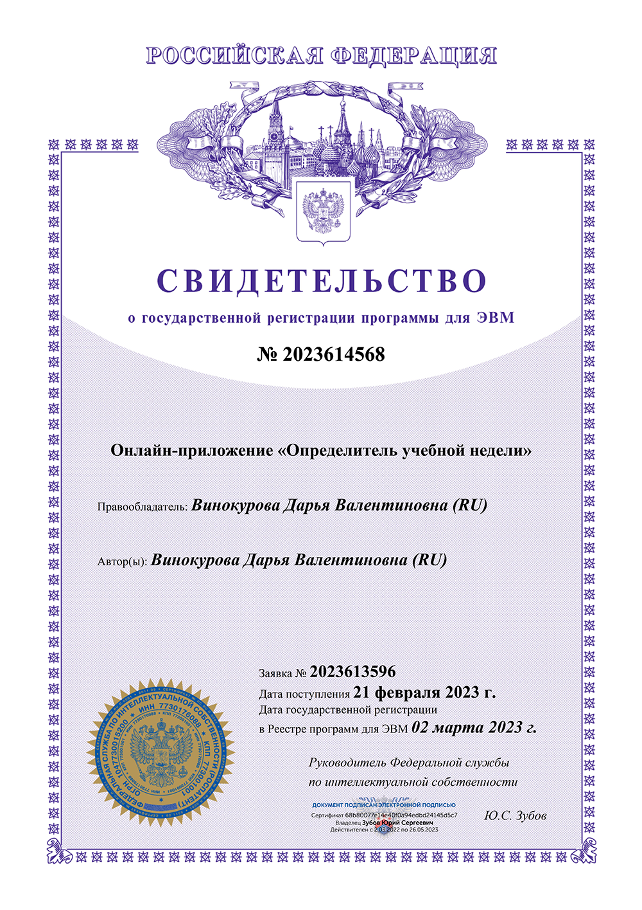

# SWD - School Week Determiner - Определитель Учебной Недели
Программа позволяет преподавателям и обучающимся различных высших и средних учебных
заведений определять текущую учебную неделю. Существует два варианта формата вывода
недели: верхняя/нижняя или нечетная/четная. При выборе формата и даты начала текущего
учебного семестра в браузере отображается текущая дата, порядковый номер учебной недели,
ее наименование, в зависимости от формата, и календарь на весь семестр с выделенными
учебными неделями. 
 Тип ЭВМ: IBM PC-совмест. ПК. ОС: Windows ХР/7/8/10.

# Автор
© Винокурова Д.В. (RUS), Vinokurova D.V. (EN), 2023

